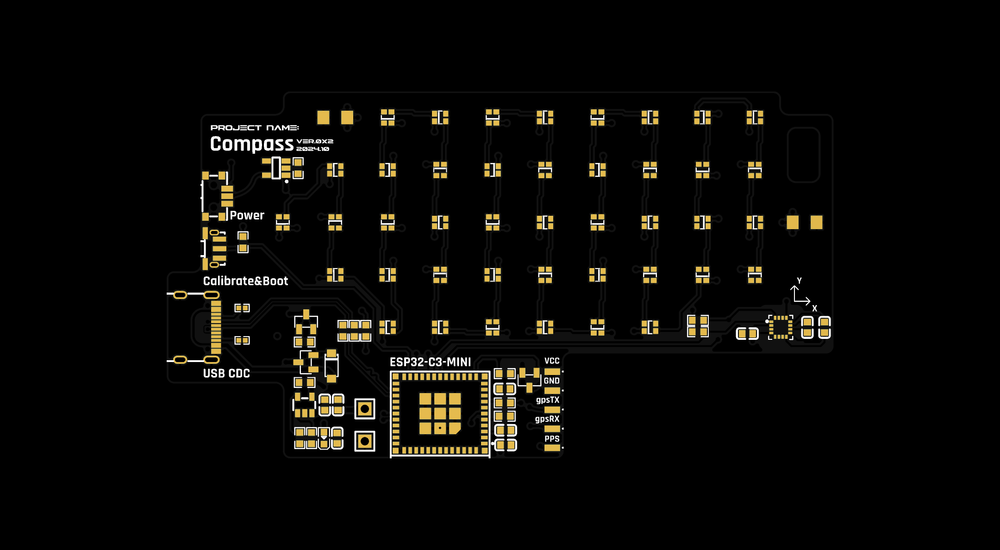
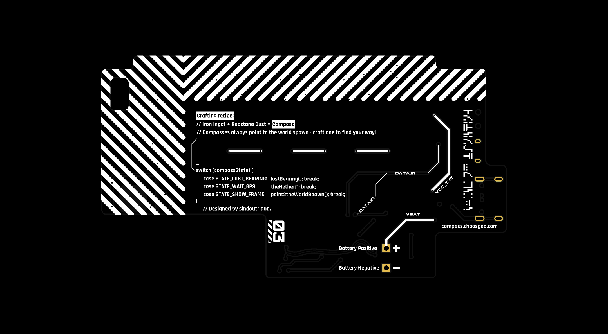
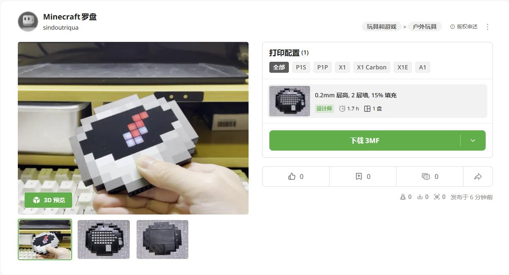

# A real-world Minecraft compass

Front|Bottom
-|-
|

## Disclaimer

The translated original readme.md starts after this paragraph. I forked this project just to have it in my github. As my mandarin is not existent, i translated just the readme.md with Deepl. Every other document, page, code is untouched. I´m not a developer. I have no clue how things are working here on GitHub and therefore if it wasnt already clear this isn´t my project and i cant guarantee that everything is correctly translated. I would appreciate if the professionals could have a look tell me whats needed to be changed. 

## Original Content - Translated with DeepL

All Minecraft game materials are copyrighted by Microsoft, so this project does not provide images of the compass in the game.
The panel files only provide the outline, and the pixel blocks have been drawn.
The original image used to model the compass is not provided.
The copyright of the standard Galaxy font printed on the back of the PCB is unclear. If you use this project for commercial purposes, please remove the standard Galaxy font from the back.

Translated with DeepL.com (free version)

## Compilation Notes

### Cannot compile
The warehouse has added GitHub Actions. You can directly click [Actions](https://github.com/chaosgoo/mcompass/actions) to find the most recent successful “Build Firmware Workflow” build record.

There are four files at the bottom of the page after clicking. Download one as needed. Except for the default configuration, there is no difference between them.
Whether you use WiFi or Bluetooth configuration, you can still switch between them via the web page or Bluetooth later.
Name|Description
-|-
mcompass-639b762-LITE-BLE.bin |Standard version, Bluetooth mode, configuration using mini program
mcompass-639b762-GPS-BLE.bin | GPS version, Bluetooth mode, configuration using mini program
mcompass-639b762-LITE-WIFI.bin | Standard version, WiFi mode, use web page configuration
mcompass-639b762-GPS-WIFI.bin | GPS version, WiFi mode, use web configuration

After downloading, unzip the file to obtain the **mcompass.bin** file. Use **Flash Download Tool** to select ESP32C3->USB to download the firmware.

The firmware has merged `bootload.bin, partitions.bin, firmware.bin, littlefs.bin` and can be directly burned to address 0x0. Keep the remaining parameters at their default values: SPI SPEED: 40 MHz; SPI MODE: DIO.

### Manual compilation
The firmware is written using the Arduino framework on the PlatformIO platform, and the dependent libraries have been migrated to the local lib folder.
Please search for the installation method for PlatformIO yourself.

`
The Firmware/assets folder contains an extract_pixels.py script that detects the 10x5 image in compass{id}.bmp in the Firmware/assets folder, takes a mold based on the LED light bead layout, and generates the corresponding header file.

#### Web Resource Compilation
The server for WiFi mode is developed using Next.js. After installing Node.js, go to the Server folder and run `npm i` to install the required dependencies.

After running `npm run build` to generate the files required for building the web service, copy the contents of the generated `Server/out` folder to the `Firmware/data` folder. At this point, you can use `Firmware/assets/compass_web_data.py` to further compress the web resources, thereby reducing flash usage and significantly improving the success rate of page loading.
Finally, use the built-in `Build Filesystem Image` and `Upload Filesystem Image` commands in PlatformIO to upload the server files to the device.

## Function Description

### Bluetooth background mode

Within one minute after startup, you can search and connect via the **Compass Console** mini program. When using the **Compass Console**, make sure to grant the mini program the necessary permissions (Bluetooth, location selection), and don't forget to turn on Bluetooth.
In the mini program, you can customize the color of the pointer, calibrate the sensor, and select the target location on the map.

### web page backend mode

* Upon first startup, the device detects the birthpoint configuration. If no birthpoint is configured, it will create a hotspot named **The Lost Compass**. After connecting to this hotspot, open a browser and enter [esp32.local](http://esp32.local) to access the backend. If the webpage cannot be opened, you can also try using the default gateway address of the ESP32C3 hotspot [192.168.4.1](http://192.168.4.1). After configuration is complete, restart the device for the changes to take effect;
* If you have configured a Wi-Fi address in the backend, the device will attempt to connect to Wi-Fi upon the next startup. If the connection fails, it will create the hotspot again for you to reconfigure;
* Whether in hotspot mode or connected to WiFi, quickly press the button four times to display the current device's IP address;

### Button

* Press the button four times quickly in succession
   * In WEB server mode, the current device's IP address will be displayed;
* Press the button six times quickly in succession to enter sensor calibration        mode. A digital countdown will be displayed. Once the countdown ends, pick up the   compass and draw an “8” in the air, rotating the device in all directions as much   as possible;
* Press the button quickly eight times in succession to enter factory settings, which will clear all configurations and restore factory settings;
* Hold down the button
   * In birth needle mode, when there is a GPS signal, holding down the button can       set the current location as the new birth point;
   * In compass mode, holding down the button will switch to nether mode, and the        needle will begin to spin randomly;

*Note: GPS signal is only available in open outdoor environments. Without GPS signal, the needle will spin randomly.*

## Material Specifications
* PCB board thickness: 1.0mm, black solder mask, manufactured by Jiali;
* Panel manufactured by Lichuang Mall, parameters: 1.0mm semi-transparent black acrylic with strong light blocking, no backing adhesive required, to be bonded with adhesive later;
* Light-diffusing material: PET LGT075J, no backing tape required, to be bonded       with adhesive later;  
* Battery specifications: 213455 500mAh  
* Knurled nut: M2x3x3.2  
* Screw: M2x4 hex socket
* GPS ATGM336H 5N71 module + antenna, dimensions 13.1mm x 15.7mm

## Model  
[MakerWorld](https://makerworld.com.cn/zh/models/667420#profileId-611642)  

## PCB Engineering and Panel Files
[PCB Engineering Files and Panel](https://oshwhub.com/chaosgoo/wcompass)

## References
[Calculating Distance and Azimuth Using GPS Coordinates by Blue Drifter](https://johnnyqian.net/blog/gps-locator.html)

## Update Log
See [update.md](./Doc/update.md)
